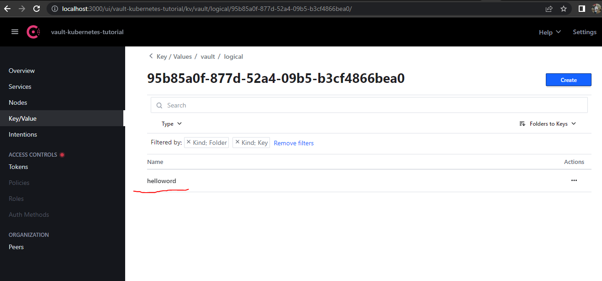

# VAULT

## Setting up a Kubernetes cluster

For the purpose of this practice, we will be using kubernetes in docker and we will deploy that using **kind**. Deploy kubernetes cluster with **kind.yaml** file and the command below:
```
cd vault-practice

kind create cluster --name vault --config kind.yaml
kubectl cluster-info --context kind-vault
kind get clusters
```

Create a namespace called **vault** where we will deploy vault.

## Vault (Dev mode)

Vault can be run in development mode to automatically handle initialization, unsealing, and setup of a KV secrets engine.

Next, lets install Vault onto Kubernetes (running in dev mode).

```
kubectl config set-context --current --namespace=vault

helm repo add hashicorp https://helm.releases.hashicorp.com

helm install vault hashicorp/vault --set server.dev.enabled=true

kubectl exec -it vault-0 vault operator init
kubectl exec -it vault-0 vault operator unseal

kubectl -n vault exec -it vault-0 -- sh
vault operator init
vault operator unseal

kubectl -n vault exec -it vault-0 -- vault status

vault login

# From inside the pod, set the following environmental variables
export VAULT_ADDR=http://127.0.0.1:8200
export VAULT_TOKEN=<your token>

kubectl port-forward vault-0 8200:8200
```

### Configure Vault

#### Step 1
Next, lets configure Vault.

```
kubectl exec -it vault-0 /bin/sh
```

For a client to access the secret data defined, at secret*, requires that the read capability be granted for the path secret*. This is an example of a policy. A policy defines a set of capabilities. We will deploy an application that will be expecting credentials on disk. For this to work, we need to go inside vault and create a policy and a role. Policies and roles allow us to map secrets to service account and consequently to pods. The pod for our application will be running as a service account. And the service account which is residing in kubernetes should be granted access to the secrets/credentials residing inside the vault through the use of policy. 

Next, lets configure a policy that we can then attach a role to (used for accessing secrets from a Kubernetes service account).This policy will map our service account to a bunch of secrets. This policy tells the role what secrets it can access. The **(*)** in the app-policy.hcl policy gives the service account read access to all secrets in the secret folder.

```
cat <<EOF > /home/vault/app-policy.hcl
path "secret*" {
  capabilities = ["read"]
}
EOF
```

Then, lets apply the policy.

```
vault policy write app /home/vault/app-policy.hcl
```

#### Step 2
Vault provides a Kubernetes authentication method that enables clients to authenticate with a Kubernetes Service Account Token. Vault accepts this service token from any client within the Kubernetes cluster. During authentication, Vault verifies that the service account token is valid by querying a configured Kubernetes endpoint. In other for the injector to be aythorized to access vault and for vault to authenticate with the kubernetes API to make sure that it trusts the pod, we need to enable **kubernetes auth** configuration. You must configure kubernetes auth to authenticate and communicate with kubernetes. Vault needs to make API call to kubernetes. These credentials are now stored in the kubernetes auth secret engine. Login to vault. Enable kubernetes auth, create auth/kubernetes/config file.

Next, enable the kubernetes auth method.

```
vault auth enable kubernetes
```

Next, lets configure the kubernetes auth method, so it can communicate with Kubernetes.

```
vault write auth/kubernetes/config \
   token_reviewer_jwt="$(cat /var/run/secrets/kubernetes.io/serviceaccount/token)" \
   kubernetes_host=https://${KUBERNETES_PORT_443_TCP_ADDR}:443 \
   kubernetes_ca_cert=@/var/run/secrets/kubernetes.io/serviceaccount/ca.crt
```
where
- grabs the vault service account token
- points it to kubernetes API
- grabs the ca-cert and writes it to a file.

Output
```
Success! Data written to: auth/kubernetes/config
```

To apply this policy requires the authentication engine to define a role. A role binds policies and environment parameters together to create a login for the web application. Next, lets connect the policy we created earlier to a myapp role. This will be used in a minute when we create our Kubernetes service account for our demo apps so they are allowed to pull down secrets from Vault.

Create a Kubernetes authentication role, named myapp, that connects the Kubernetes service account name and app policy.

```
vault write auth/kubernetes/role/myapp \
   bound_service_account_names=app \
   bound_service_account_namespaces=app \
   policies=app \
   ttl=1h
```
We are creating **auth/kubernetes/role/myapp** role. We are binding service accout name=app to service account namespace=app to the policy=app for ttl=1h. This will map the service account of our pod to the policy, thereby mapping the pod running as a service account to the policy.
 
Output
```
Success! Data written to: auth/kubernetes/role/myapp
```
Next, enable kv path=secret and create some secrets.

```
vault secrets enable -path=secret kv
vault kv put secret/helloworld username=foobaruser password=foobarbazpass
vault kv put secret/payment-api APIKEY=497CA26DA27E
vault kv put secret/sendmail-api APIKEY=F5863ABDB85A
```

You can list the secrets by running
```
vault kv list secret
Keys
----
helloworld
payment-api
sendmail-api
```

Finally, we are done. Lets exit out.

```
exit
```

### Injecting Credentials from vault into our Application
We have an application which wants to connect to the database running in the cloud or a key value store and it needs a credential. So we have a pod running on a kubernetes cluster that is expecting credentials on disk. To authenticate and trust that this pod have access to this secret/credentials, our applicaton pod will be running with a service account. The vault policy binds this service account to bunch of secrets. Then vault will use this service account to verify through the kubernetes API that this pod is trusted with the kubernetes auth configuration for vault. Then we will deploy the vault-injector to inject our secret into the pod and the pod is completely unaware of the vault existence, all it expects is a credential on disk to be able to access a database.


#### Injector (If you are deploying injector seperately from vault)
Injector is another pod running along side with the vault pod. It is the responsibility of the injector to inject our secrets from vault into our application. To set up our injector, we will need the service account, a clusterRole which allows it to list, watch and patch **mutatingwebhook configurations and clusterRoleBinding**

To get this mutatingwebhook working, you need the **admissionregistration.k8s.io/v1(/v1betav1)** API enabled in your kubernetes cluster. To check, do **kubectl api-versions**. Deploy the injector and make sure it is running.

#### Webhook-mutating webhook
Anytime a pod gets created or updated (rules.resourses:["pod"]), this "mutate" path API endpoint is called. Anytime someone applies a deployment and a pod is created or updated, kubernetes API would make a call to this webhook and it will be able to inject a secret into our pod. This webhook always watches out for creation and updating of a pod and has the capability of mutating (configuring) any pod. However, our pod needs to have the annotations for vault in other to opt in for secret injection.

#### Troubleshooting
If you deploy and your pod is not created, take a look at the kube-system namespace, at the kubernetes API logs, it will show you that its trying to make a call to webhook and whether its successful. Also take a look at the injector pod logs and you should see it is recieving the request and doing the mutation.

### Running through the demo

Here's a breakdown of what we are going to test:

```
app.yaml                          # demo app that knows nothing about vault
patch-basic-annotations.yaml      # sidecar proof of concept
patch-template-annotations.yaml   # now, lets use templates
patch-template-realworld.yaml     # now, lets use multiple secrets
job-pre-populate-only.yaml        # show how jobs work
```

Lets launch our demo app that knows nothing about Vault (plus create the service account).

```
kubectl create ns app
kubectl create -f app.yaml -n app
kubectl exec -it app-<POD_NAME> -c app -- ls -l /vault/secrets
```

Next, lets view the definition to check for annotations (there should be none).

```
kubectl describe pod app-<POD_NAME> | less
```

Next, lets inject a secret via a sidecar and prove it works. Two containers will be spun up our app and a sidecar.

```
kubectl patch deployment app --patch "$(cat patch-basic-annotations.yaml)" -n app
kubectl exec -it app-<POD_NAME> -c app -n app sh
ls -l /vault/secrets
cat /vault/secrets/helloworld
```

Lets check our annotations again (we should see some).

```
kubectl describe pod app-<POD_NAME> | less
```

Next, lets use a template to format the data into something useful.

```
kubectl patch deployment app --patch "$(cat patch-template-annotations.yaml)" -n app
kubectl exec -it app-<POD_NAME> -c app -n app sh
ls -l /vault/secrets
cat /vault/secrets/helloworld
```
output
```
kubectl exec -it app-77f556d56c-pbn5c -c app -n app sh
kubectl exec [POD] [COMMAND] is DEPRECATED and will be removed in a future version. Use kubectl exec [POD] -- [COMMAND] instead.
/app # ls -l /vault/secrets/
total 4
-rw-r--r--    1 100      1000            64 Apr 19 09:51 helloworld
/app # cat /vault/secrets/helloworld
{
  "username" : "foobaruser",
  "password" : "foobarbazpass"
}
/app #
```

Next, lets look at a real world example with multiple secrets. In real world containers expect more than one secret or multiple secrets with multiple formats. The patch-template-realworld.yaml file contains multiple secrets and formats.

```
kubectl patch deployment app --patch "$(cat patch-template-realworld.yaml)" -n app
kubectl exec -it app-<POD_NAME> -c app -n app sh
ls -l /vault/secrets
cat /vault/secrets/helloworld
```

So the complete deployment for our app should look like the one we have in **app-realworld-deployment.yaml** file. All the files can be found at /vault-practice/app-demo.

#### Our app-realworld-deployment.yaml

The deployment yaml file has normal configuration but should contain the following sections:
1. The **spec** section contains a service account (app). The pod will run with the service account (app) which has been mapped to a role which is mapped to a policy that is mapped to a bunch of secrets (secret*).
2. The annotation section. The key thing and what makes our pod opt in for secret injection is the vault annotations. We are telling vault to inject = true (agent-inject), agent-inject-secret-helloworld = "secret/helloworld". We are telling vault what secret to inject.
3. A template for the secret. We can run a Go templating engine on top the secret and transform it to any kind of configuration or format that the application is expecting it. In this case our application is expecting a json file. You can have postgres equal connection string. You can also have multiple secrets with multiple templates if your application is expecting multiple secrets from vault.
4. The role we created inside vault should be specified. The role that is mapped to a policy which is mapped to secrets.


Next, lets check out how you might configure a background job.

```
kubectl create -f job-pre-populate-only.yaml
kubectl logs pgdump-
```

## Clean up

Lets delete our demo app.

```
kubectl delete deployment app -n app
```

# Vault (HA mode)

Reference: https://developer.hashicorp.com/vault/tutorials/kubernetes/kubernetes-raft-deployment-guide

## TLS

We will be running vault with tls enabled for end to end encryption. Therefore we will be gernerating a private Certificate Authority (CA), we will pass the path to the CA Cert using the environment variable VAULT_CACERT through the use of the **server.extraEnvironmentVars** attribute, such as:
```
server:
  extraEnvironmentVars:
    VAULT_CACERT: /vault/userconfig/tls-ca/ca.crt
```

To create this file and path inside the Vault Pods, you can create a Kubernetes Secret from the contents of the TLS Certificate file and this can be mounted using the **server.extraVolumes** attribute.

The Kubernetes Secret needs to be created before the installation of the Vault Helm chart.

Lets create the certificates and the corresponding kubernetes secrets.

The tls folder contains ca-config.json, ca-csr.json files we will use to generate a self signed certificate. I will be running a small debian container where I will be doing all the work of generating certificate from. This will enable me to run cfssl linux commands and will copy the files from the container to my local machine.
### Use CFSSL to generate certificates

More about [CFSSL here]("https://github.com/cloudflare/cfssl")

```
docker run -it --rm debian bash

apt-get update && apt-get install -y curl vim &&
curl -L https://github.com/cloudflare/cfssl/releases/download/v1.6.1/cfssl_1.6.1_linux_amd64 -o /usr/local/bin/cfssl && \
curl -L https://github.com/cloudflare/cfssl/releases/download/v1.6.1/cfssljson_1.6.1_linux_amd64 -o /usr/local/bin/cfssljson && \
chmod +x /usr/local/bin/cfssl && \
chmod +x /usr/local/bin/cfssljson

vi ca-config.json
vi ca-csr.json

#generate ca in /tmp (root certificate and key )
cfssl gencert -initca ca-csr.json | cfssljson -bare /tmp/ca

#generate certificate in /tmp (vault server certificate and key)
cfssl gencert \
  -ca=/tmp/ca.pem \
  -ca-key=/tmp/ca-key.pem \
  -config=ca-config.json \
  -hostname="vault,vault.vault.svc.cluster.local,vault.vault.svc,localhost,127.0.0.1" \
  -profile=default \
  ca-csr.json | cfssljson -bare /tmp/vault
```

view and copy the files:

```
ls -l /tmp
```
### Create a kubernetes secret for both the ca certificate and vault server certificate.

```
kubectl -n vault create secret tls tls-ca \
 --cert ./tls/ca.pem  \
 --key ./tls/ca-key.pem

OR from inside the tls folder
kubectl -n vault create secret tls tls-ca --cert ca.pem --key ca-key.pem

kubectl -n vault create secret tls tls-server \
  --cert ./tls/vault.pem \
  --key ./tls/vault-key.pem

OR from inside the tls folder
kubectl -n vault create secret tls tls-server --cert vault.pem --key vault-key.pem
```
## Vault Installation with Raft and TLS enabled

```
kubectl create namespace vault
kubectl --namespace='vault' get all
```

To access the Vault Helm chart, add the Hashicorp Helm repository.
```
helm repo add hashicorp https://helm.releases.hashicorp.com

helm search repo hashicorp/vault

helm install vault hashicorp/vault --namespace vault --dry-run
```

Specifing  the desired configuration in a file, **override-raft-values.yml**. This contains the minimun yaml that we need to get vault server up and running. It contains configurations for tls, injector with its resource limits, server with its resource limits according to the size of my cluster, readinessProbe and livenessProbe. Most importantly, the VAULT_CACERT environmental variable to tell vault where our tls (root) certificate lives and we will be mounting those certificates into our pods and the volumes for the certificates. And the configuration part (configmap) where we set replicas, tls and the storage.

The below command will dry run vault in the namespace with version with the override-raft-values.yaml and print the full yaml files used to deploy our vault server into manifests/vault-raft.yaml file.

```
helm template vault hashicorp/vault --namespace vault -f override-raft-values.yaml > manifests/vault-raft.yaml
```

Check for the following in the manifests/vault-raft.yaml:
1. Go to the stateful set section, check for the volume at spec.template.spec.volume
2. Go down to the spec.template.spec.container section,chec for the volume mount.
3. Go to the configmap and check that the tls is enabled. Therefore for tls configuration, configure the statefulset, configmap and tls secret file.
4. Make sure that the VAULT_ADDR and the VAULT_API_ADDR are on https for the spec.template.spec.container.env.
5. Go to the liveliness and readiness probe section and configure scheme = HTTPS
6. Check the persistence volume objects, pv and pvc. The pv creates a 10Gib volume on my local machine and mounts it in the "mnt/data" directory of the vault container.

### Install the Vault Helm chart

```
helm install vault hashicorp/vault --namespace vault -f override-raft-values.yaml
helm upgrade -i vault hashicorp/vault --namespace vault -f override-raft-values.yaml

kubectl get po -n vault
```

### Initialize and unseal Vault

After the Vault Helm chart is installed, one of the Vault servers need to be initialized. The initialization generates the credentials necessary to unseal all the Vault servers.

Exec into the pod and run **vault operato init** to get the five keys and the root token. We need to do the unsealing three times per vault instance. Run vault status on the three pods to check thier status.

```
kubectl -n vault exec -it vault-0 vault operator init

kubectl -n vault exec -it vault-0 -- sh
kubectl -n vault exec -it vault-1 -- sh
kubectl -n vault exec -it vault-2 -- sh

vault operator init
vault operator unseal
```

Login to vault-0 with the root token

```
vault login
```
Output
```
Token (will be hidden): 
Success! You are now authenticated. The token information displayed below
is already stored in the token helper. You do NOT need to run "vault login"
again. Future Vault requests will automatically use this token.

Key                  Value
---                  -----
token                hvs.pO20qR07ZHT1fYSOVBN6l7R0
token_accessor       4h9omPQFUtq4BzobzRT9YOoM
token_duration       ∞
token_renewable      false
token_policies       ["root"]
identity_policies    []
policies             ["root"]
```

```
kubectl -n vault exec -it vault-0 -- vault status
kubectl -n vault exec -it vault-1 -- vault status
kubectl -n vault exec -it vault-2 -- vault status
```

When the vault is unsealed, pod can now access, create or update secrets and you will have the pod 1/1 running. Port-forward the vault service to check the UI and connect with the root token.

### Joining vault-1 and vault-2 pods to the vault-0 cluster 

The configuration file in the override-raft-values.yaml file contains the configurations to automatically join vault-1 and vault-2 pods to the vault-0 cluste when installing the vault server. This is contained in the storage section of the config at the retry_join for vault-0 to vault-4

But where the above configuration is not specified, below is the steps to join vault-1 and vault-2 to the vault-0 cluster.

1. List all the nodes within the Vault cluster for the vault-0 pod.

```
kubectl exec vault-0 -- vault operator raft list-peers
```

Join vault-1 and vault2 pods to the Raft cluster

2. Start an interactive shell session on the vault-1 pod.
```
kubectl exec -n vault -it vault-1 -- /bin/sh
```

3. Join the vault-1 pod to the Raft cluster.

```
vault operator raft join -address=https://vault-1.vault-internal:8200 -leader-ca-cert="$(cat /vault/userconfig/tls-ca/tls.crt)" -leader-client-cert="$(cat /vault/userconfig/tls-server/tls.crt)" -leader-client-key="$(cat /vault/userconfig/tls-server/tls.key)" https://vault-0.vault-internal:8200
```

4. Start an interactive shell session on the vault-2 pod.

```
kubectl exec -n vault -it vault-2 -- /bin/sh
```

5. Join the vault-2 pod to the Raft cluster.

```
vault operator raft join -address=https://vault-2.vault-internal:8200 -leader-ca-cert="$(cat /vault/userconfig/tls-ca/tls.crt)" -leader-client-cert="$(cat /vault/userconfig/tls-server/tls.crt)" -leader-client-key="$(cat /vault/userconfig/tls-server/tls.key)" https://vault-0.vault-internal:8200
```

6. List the raft peers.

```
kubectl exec -n vault vault-0 -- vault operator raft list-peers
```

7. Print the HA status

```
kubectl -n vault exec -it vault-0 -- vault status
```

We now have a working 3 node cluster with TLS enabled at the pod level. Next you will create a secret and retrieve it via an API call to confirm TLS is working as expected. Use the example app above we used at intalling vault server at dev mode.

### Web UI
Let's checkout the web UI. To access the vault UI,  open another terminal, port-forward to the vault UI service. 

```
kubectl get svc -n vault
kubectl port-forward svc/vault-ui 8200:8200 -n vault
```

Access the browser using : https://127.0.0.1:8200

## Vault Installation with Consul and TLS enabled

### Storage : Consul
Consul is a service mesh solution that launches with a key-value store. Vault requires a storage backend like Consul to manage its configuration and secrets when it is run in high-availability. We will use a very basic Consul cluster for our Vault backend.

### Install the Consul Helm chart
The recommended way to run Consul on Kubernetes is via the Helm chart. Consul's Helm chart by default starts more services than required to act as Vault's storage backend. Specifing  the desired configuration in a file, consul-values.yml. This contains the minimun yaml that we need to get vault consul up and running.

The below command will dry run consul in the namespace with the consul-values.yaml and print the full yaml files used to deploy our single server of consul into manifests/consul.yaml file. The consul-values.yaml is the most basic file to deploy a single server of consul.

```
helm template consul hashicorp/consul --namespace vault -f override-consul-values.yaml > manifests/consul.yaml
```

Deploy the consul services:
```
helm install consul hashicorp/consul --namespace vault -f override-consul-values.yaml

kubectl -n vault get pods
```

Output:
```
NAME                                                  READY   STATUS    RESTARTS      AGE
consul-consul-client-qv6r5                            1/1     Running   0             34m
consul-consul-client-r6jmp                            1/1     Running   0             34m
consul-consul-client-s7l9t                            1/1     Running   0             consul-consul-connect-injector-86d4d8b875-7lzbv       1/1     Running   2 (14m ago)   34m
consul-consul-server-0                                1/1     Running   0             34m
consul-consul-webhook-cert-manager-79b9df7c96-7wwtj   1/1     Running   0             34m
```

Wait until the server and client pods report that they are Running and ready (1/1).

### Install the Vault Helm chart

1. Get the Vault Helm chart in a manifest folder.

```
helm template vault hashicorp/vault --namespace vault -f override-vault-values.yaml > manifests/vault-consul.yaml
```

2. Install Vault Helm chart in HA mode with consul storage.

```
helm install vault hashicorp/vault --namespace vault -f override-vault-values.yaml
helm upgrade -i vault hashicorp/vault --namespace vault -f override-vault-values.yaml
```

3. Get all the pods within the vault namespace

```
kubectl get po -n vault
```

4. Retrieve the status of Vault on the vault-0 pod.

```
kubectl exec vault-0 -- vault status -n vault
```
### Initialize and unseal the Vault pod

1. Initialize Vault with one key share and one key threshold.

```
kubectl exec vault-0 -- vault operator init \
    -key-shares=1 \
    -key-threshold=1 \
    -format=json > cluster-keys.json
Or
kubectl exec vault-0 -- vault operator init -key-shares=1 -key-threshold=1 -format=json > cluster-keys.json
```

The operator init command generates a root key that it disassembles into key shares -key-shares=1 and then sets the number of key shares required to unseal Vault -key-threshold=1. These key shares are written to the output as unseal keys in JSON format -format=json. Here the output is redirected to a file named cluster-keys.json.

2. Display the unseal key found in cluster-keys.json.

```
cat cluster-keys.json | jq -r ".unseal_keys_b64[]"
```

3. Create a variable named VAULT_UNSEAL_KEY to capture the Vault unseal key.

```
VAULT_UNSEAL_KEY=$(cat cluster-keys.json | jq -r ".unseal_keys_b64[]")
```

4. Unseal Vault running on the vault-0 pod.

```
kubectl exec vault-0 -- vault operator unseal $VAULT_UNSEAL_KEY
```

5. Retrieve the status of Vault on the vault-0 pod.

```
kubectl exec vault-0 -- vault status
```

6. Unseal Vault running on the vault-1 pod.

```
kubectl exec vault-1 -- vault operator unseal $VAULT_UNSEAL_KEY
kubectl exec vault-2 -- vault operator unseal $VAULT_UNSEAL_KEY
```

7. Verify all the Vault pods are running and ready with vault status.

8. Login to vault-0 with the root token

9. We now have a working 3 node cluster with TLS and consul enabled. Next you will create a secret and retrieve it via an API call to confirm TLS and consul is working as expected. Use the example app above we used at intalling vault server at dev mode.

Below is the picture of the secret stored in consul


### Join the other Vaults to the Vault cluster

The Vault server running on the vault-0 pod is a Vault HA cluster with a single node. To display the list of nodes requires that you are logging in with the root token.

1. Display the root token found in cluster-keys.json.

```
cat cluster-keys.json | jq -r ".root_token"
```

2. Create a variable named CLUSTER_ROOT_TOKEN to capture the Vault unseal key.

```
CLUSTER_ROOT_TOKEN=$(cat cluster-keys.json | jq -r ".root_token")
```

3. Login with the root token on the vault-0 pod.

```
kubectl exec vault-0 -- vault login $CLUSTER_ROOT_TOKEN
```

4. List all the nodes within the Vault cluster for the vault-0 pod.


### Web UI
Let's checkout the web UI. To access the vault and consul UI,  open another terminal, port-forward to the vault and consul UI service.

```
kubectl port-forward svc/vault-ui 8200:8200 -n vault
kubectl port-forward svc/consul-consul-ui 3000:80 -n vault
```

Access the browser using : https://127.0.0.1:8200 and localhost:3000


### Injecting Credentials from vault into our Application
We have a database and a pod running on a kubernetes cluster that is expecting credentials on disk. How can we authenticate and trust that this pod have access to this secret. 

Our applicaton pod will be running with a service account. In our vault we will create a policy that binds this service account to a bunch of secrets. Then vault will use this service account to verify through the kubernetes API that this pod is trusted. Then we will set up a kubernetes auth configuration for vault and will deploy the vault-injector to inject our secret into the pod and the pod is completely unaware of the vault existence, all it expects is a credential on disk to be able to access the database.

From the UI, you will see that we've enabled kubernetes and kv secret engine having a folder secret/basic-secret/helloworld having some some credentials inside. You will also notice our basic-secret-policy.

## Dynamic Injection
we have an application which wants to connect to the database and it needs and expecting a credential on disk. This database can be an external storage running in the cloud or a key value store.

We want vault to automatically create users in our database and assign it a password and inject this credentials into our application without the knowlegde of the application and the database. We also want vault to control the credentials end to end, ie the whole life cycle of the credentials so that when the application pod dies, vault will revoke the credentials. And if we have a ttl in the credentials, vault should generate a new one and inject into our pod when the ttl expires.

We will use a mysql Database.

## Install the MySQL Helm chart

MySQL is a fast, reliable, scalable, and easy to use open-source relational database system. MySQL Server is intended for mission-critical, heavy-load production systems as well as for embedding into mass-deployed software.

1. Add the Bitnami Helm repository.

```
helm repo add bitnami https://charts.bitnami.com/bitnami
```

2. Install the latest version of the MySQL Helm chart.

```
helm install mysql bitnami/mysql -n vault

helm upgrade -i mysql bitnami/mysql --version 9.8.2 -n vault

helm upgrade -i mysql bitnami/mysql --version 9.8.2 --set primary.startupProbe.enabled=false,primary.readinessProbe.enabled=false,primary.livenessProbe.enabled=false -n vault

helm upgrade -i mysql bitnami/mysql --version 9.8.2 --set primary.startupProbe.timeoutSeconds=30,primary.startupProbe.initialDelaySeconds=30
```

Output
```
NAME: mysql
LAST DEPLOYED: Mon May  1 12:20:05 2023
NAMESPACE: vault
STATUS: deployed
REVISION: 1
TEST SUITE: None
NOTES:
CHART NAME: mysql
CHART VERSION: 9.8.2
APP VERSION: 8.0.33

** Please be patient while the chart is being deployed **

Tip:

  Watch the deployment status using the command: kubectl get pods -w --namespace vault

Services:

  echo Primary: mysql.vault.svc.cluster.local:3306

Execute the following to get the administrator credentials:

  echo Username: root
  MYSQL_ROOT_PASSWORD=$(kubectl get secret --namespace vault mysql -o jsonpath="{.data.mysql-root-password}" | base64 -d)       

eljM1eHiax
To connect to your database:

  1. Run a pod that you can use as a client:

      kubectl run mysql-client --rm --tty -i --restart='Never' --image  docker.io/bitnami/mysql:8.0.33-debian-11-r3 --namespace vault --env MYSQL_ROOT_PASSWORD=$MYSQL_ROOT_PASSWORD --command -- bash

  2. To connect to primary service (read/write):

      mysql -h mysql.vault.svc.cluster.local -uroot -p"$MYSQL_ROOT_PASSWORD"
```

By default the MySQL Helm chart deploys a single pod a service.


3. Get all the pods within the default namespace.
```
kubectl get pods
```
The mysql-0 pod runs a MySQL server.

4. Get all the services within the default namespace.

```
kubectl get services
```
The mysql service directs request to the mysql-0 pod. Pods within the cluster may address the MySQL server with the address **mysql.vault.svc.cluster.local**.

The MySQL root password is stored as Kubernetes secret. This password is required by Vault to create credentials for the application pod deployed later.

5. Create a variable named ROOT_PASSWORD that stores the mysql root user password.

```
ROOT_PASSWORD=$(kubectl get secret --namespace vault mysql -o jsonpath="{.data.mysql-root-password}" | base64 --decode)
```
The MySQL server, addressed through the service, is ready.

## Create a Vault database role

With a vault cluster up and running. Our web application expects Vault to store a username and password at the path secret/webapp/config. To create this secret requires you to login with the root token, enable the key-value secret engine, and store a secret username and password at that defined path.

1. Enable database secrets at the path database. To tell vault about our database, we need to enable the database engine. This will help us configure our database credentials creation.


```
kubectl exec vault-0 -- vault secrets enable database
```

2. Configure the database secrets engine with the connection credentials for the MySQL database. This will tell vault about our database and authorise vault to act on our behalf. **Note** you probably won't use your database master password but could create a user account with permission to delegate the creation of user account on our behalf.

```
kubectl exec vault-0 -- vault write database/config/mysql \
    plugin_name=mysql-database-plugin \
    connection_url="{{username}}:{{password}}@tcp(mysql.default.svc.cluster.local:3306)/" \
    allowed_roles="readonly" \
    username="root" \
    password="$ROOT_PASSWORD"
```
Output:
```
Success! Data written to: database/config/mysql
```

3. Create a database secrets engine role named **mysql-role**. We also tell vault how to create these users, so we put in the mysql statement defining the type of users we want to create with expiration time of one hour.

```
kubectl exec vault-0 -- vault write database/roles/mysql-role \
    db_name=mysql \
    creation_statements="CREATE USER '{{name}}'@'%' IDENTIFIED BY '{{password}}';GRANT SELECT ON *.* TO '{{name}}'@'%';" \
    default_ttl="1h" \
    max_ttl="24h"
```
The mysql-role role generates credentials that are able to perform queries for any table in the database.

Output:
```
Success! Data written to: database/roles/readonly
```

4. Read credentials from the mysql-role database role.

```
kubectl exec vault-0 -- vault read database/creds/mysql-role


```

Vault is able to generate crentials within the MySQL database and output on the screen.


### Configure Vault Kubernetes authentication (used by the app deployment)

The initial root token is a privileged user that can perform any operation at any path. The web application only requires the ability to read secrets defined at a single path. This application should authenticate and be granted a token with limited access.

Vault provides a **Kubernetes authentication** method that enables clients to authenticate with a Kubernetes Service Account Token.

Now we've told vault about our database and we've delegated the user creation to vault. Therefore we've removed the need for humans to create passwords and pass them insecurely between poeple and application. The next thing is to get vault to automatically inject it into our application. This can be done with the help of  policy. In vault everything is controlled by policy. We will create a policy, bind it to the "mysql-role" role and then we can map kubernetes service account to this policy so that when we deploy our application to run with the service account, our application should automatically get the credentials injected.

1. Start an interactive shell session on the vault-0 pod.

```
kubectl exec --stdin=true --tty=true vault-0 -- /bin/sh
```

2. Enable the Kubernetes authentication method.

```
vault auth enable kubernetes

```
Vault accepts a service token from any client within the Kubernetes cluster. During authentication, Vault verifies that the service account token is valid by querying a token review Kubernetes endpoint.

3. Configure the Kubernetes authentication method to use the location of the Kubernetes API.

```
vault write auth/kubernetes/config \
   token_reviewer_jwt="$(cat /var/run/secrets/kubernetes.io/serviceaccount/token)" \
   kubernetes_host=https://${KUBERNETES_PORT_443_TCP_ADDR}:443 \
   kubernetes_ca_cert=@/var/run/secrets/kubernetes.io/serviceaccount/ca.crt
```

Output:
```
Success! Data written to: auth/kubernetes/config
```
The environment variable **KUBERNETES_PORT_443_TCP_ADDR** is defined and references the internal network address of the Kubernetes host.

For a client of the Vault server to read the credentials defined in the **Create a Vault database role** step requires that the read capability be granted for the path database/creds/mysql-role.

4. Write out the policy named devwebapp that enables the read capability for secrets at path database/creds/mysql-role

```
vault policy write devwebapp - <<EOF
path "database/creds/mysql-role" {
  capabilities = ["read"]
}
EOF
```

5. Create a Kubernetes authentication role named devweb-app.

```
vault write auth/kubernetes/role/devweb-app \
      bound_service_account_names=test-app \
      bound_service_account_namespaces=test-app \
      policies=devwebapp \
      ttl=24h
```
Output:
```
Success! Data written to: auth/kubernetes/role/devweb-app
```

The role connects a Kubernetes service account, test-app (created in the next step), and namespace, test-app, with the Vault policy, devwebapp. The tokens returned after authentication are valid for 24 hours.

## Deploy web application

The web application pod requires the creation of the test-app Kubernetes service account specified in the Vault Kubernetes authentication role created in the Configure Kubernetes authentication step.

So the complete deployment for our app which contains the service account yaml file should look like the one we have in **test-deployment.yaml** file. All the files can be found at /vault-practice/app-demo.

The deployment yaml file has normal configuration but should contain the following sections:
1. The **spec** section contains a service account (test-app). The pod will run with the service account (test-app) which has been mapped to a role which is mapped to a policy that is mapped to a bunch of secrets (database/creds/mysql-role).

2. The annotation section. The annotations is what tells vault and the injector to inject credentials. The key thing and what makes our pod opt in for secret injection is the vault annotations. We are telling vault to inject = true (agent-inject), agent-inject-secret-mysql-role = "database/creds/mysql-role" where mysql-role is the name of our secret, with the full secret name in vault which is database create mysql-role. We are telling vault what secret to inject.

3. A template for the secret. We can run a Go templating engine on top the secret and transform it to any kind of configuration or format that the application is expecting it. In this case our application is expecting a database connection string. You can have mysql equal connection string.

4. The role we created inside vault should be specified. The role that is mapped to a policy which is mapped to secrets (mysql-role). This is the role that will enable vault to do all the authentication mechanism and give us access to secret that we need.

Apply the test-app deployment yaml file which also contain the yaml file for the creation of a service account. 

```
kubectl apply -f test-deployment.yaml
```

This definition creates a pod with the specified container running with the **test-app** Kubernetes service account. The container within the pod is unaware of the Vault cluster. The Vault Injector service reads the annotations and determines that it should take action **vault.hashicorp.com/agent-inject**. The credentials, read from Vault at **database/creds/mysql-role**, are retrieved by the **devwebapp-role** Vault role and stored at the file location, **/vault/secrets/database-connect.sh**, and then mounted on the pod.

The credentials are requested first by the **vault-agent-init** container to ensure they are present when the application pod initializes. After the application pod initializes, the injector service creates a **vault-agent** pod that assist the application in maintaining the credentials during initialization. The credentials requested by the **vault-agent-init** container are cached, **vault.hashicorp.com/agent-cache-enable: "true"**, and used by **vault-agent** container.
### Testing

Exec into the pod and check if our credentials are inside our application. Run ****. Also check our database for the same credentials.

1. Get all the pods within the default namespace. Wait until the test-app pod reports that is running and ready (2/2).

2. Start an interactive shell session on the test-app pod.

```
kubectl exec -it pod-name -c test-app -n test-app -- sh
```


2. Display the secrets written to the file /vault/secrets/database-connect.sh on the test-app pod.

```
cat /vault/secrets/database-connect.sh
```

3. The result displays a mysql command with the credentials generated for this pod.

```

```

So now vault will automatically manage these accounts on our behalf. We don't need a user to manage if for us anymore or create secrets. And we don't need to insecurely pass secrets around poeple and application. All these happen automatically. 

